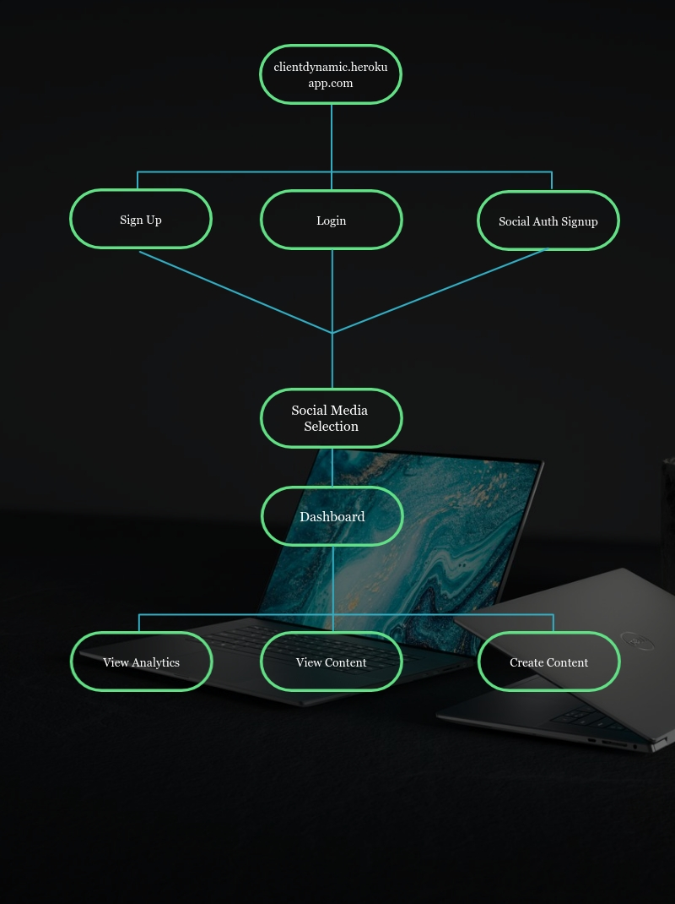

## 🚀 Client Dynamic [Live](https://clientdynamic.herokuapp.com/)

<h1 align="center">
   
  
</h1>

<h4 align="center">A single place to control all your social media presence, analytics, and content.</h4>

<!--  -->
<!--  -->

  <a href="#about">About</a> •
  <a href="#features">Features</a> •
  <a href="#user-flow">User Flow</a> •
  <a href="#authors">Authors</a> •
  <a href="#support">Support</a> •
  <a href="#project-photos">Project Photos</a> •
  <a href="#license">License</a>

## About
Client Dynamic is the perfect place to manage your social media presence, track your real-time analytics, manage and create content, and store your data.

---
 Visit our site, currently Live @ https://clientdynamic.herokuapp.com/

## Features

|                            | Client Dynamic  |
| -------------------------- | :----------------: |
|  Facebook API            |         ✔️         |        ✔️        |
|  Instagram API             |         ✔️         |        ✔️        |
|  Twitter API        |         ✔️         |        ✔️        |
|  LinkedIn API |         ✔️         |        ✔️        |
|  Real-Time Analytics          |         ✔️         |        ✔️        |
|  Content Management          |         ✔️         |        ✔️        |
|  Content Creation          |         ✔️         |        ✔️        |

## User Flow
User Flow Chart
 

## Authors

<table>
  <tr>
    <td align="center"><a href="https://github.com/anbellouzi"> <b>Anas Bellouzi</b></td>
    <td align="center"><a href="https://github.com/vladyslavnUA"> <b>Vladyslav Nykoliuk</b></td>
    <td align="center"><a href="https://github.com/AbdullahNoori"> <b>Abdullah Noori</b></td>
  </tr>
</table>

## Support

Reach out to any of the developers (authors) for support of this project.

## Project Photos
1. Landing Page

2. Login/Signup Page

3. User Profile Page

4. Link Social Media Page

5. Select Business Pages View

6. Dashboard Page

7. Posts View

## License

- Copyright © [Client Dynamic 2020](https://clientdynamic.herokuapp.com/ "Client Dynamic Live").

